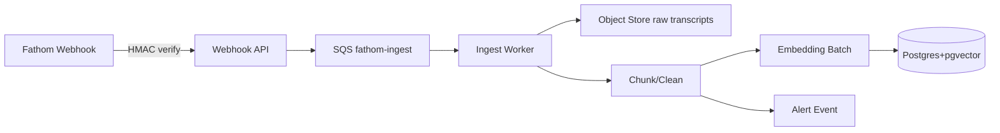

# Fathom Ingestion Pipeline Design

Target: integrate Fathom transcripts into the unified search stack alongside existing Slack ingestion. Assumes AWS primitives; swap equivalents on GCP/Azure if needed.

## High-Level Flow
1) Fathom -> webhook endpoint (`/webhooks/fathom/call-completed`)
2) Webhook verifies signature, enqueues job to `fathom-ingest` queue (SQS)
3) Ingest worker pulls job, fetches transcript JSON/recording, stores raw in object storage
4) Cleans + chunks transcript, performs optional PII scrubbing
5) Embeds chunks in batches, writes embeddings + metadata to Postgres+pgvector
6) Emits events for downstream alerts (risk/opportunity) and search index availability



## Components
- **Webhook API**: Lightweight service (FastAPI or Express) handling auth, validation, idempotency, and enqueue.
- **Queue**: SQS standard queue; DLQ for poison messages.
- **Ingest Worker**: Containerized worker (ECS Fargate/Cloud Run job) performing fetch/parse/chunk/embed/persist. Retries with backoff.
- **Object Storage**: S3 bucket `fathom-raw/<call_id>/transcript.json` (+ optional recording).
- **Database**: Postgres with pgvector extension; separate schemas per source (`slack`, `fathom`) but shared table shapes.
- **Secrets**: Stored in AWS Secrets Manager/SSM (Fathom token, webhook secret, DB, OpenAI key).

## Data Model (proposed)
- `sources(id, name, kind, created_at)`
- `documents(id, source_id, external_id, title, started_at, ended_at, workspace_id, project, tags, participants_json, visibility, created_at, updated_at)`
- `chunks(id, document_id, idx, speaker, start_ms, end_ms, text, token_count)`
- `embeddings(id, chunk_id, model, dims, vector, created_at)`
- `acls(id, document_id, principal, principal_type, access_level)` — principal maps to user email/org/workspace
- `alerts(id, document_id, chunk_id, alert_type, score, status, created_at)`
- `query_logs(id, user_id, query, filters_json, latency_ms, created_at)` for audit

## Chunking Strategy
- Group transcript segments by speaker turns and/or 30–60s windows.
- Target ~200–300 tokens per chunk; overlap 10–15% if needed for context.
- Store timing and speaker for evidence rendering.

## Embedding Strategy
- Model: `text-embedding-3-small` (fallback to `-large` if quality is insufficient).
- Batch size: 32–128 chunks per API call depending on token length.
- Retry with jitter; cache deduplication by chunk hash.

## Ingestion Job Payload
```json
{
  "event_id": "evt_123",
  "call_id": "call_abc",
  "transcript_url": "https://signed",
  "recording_url": "https://signed",
  "workspace_id": "ws_1",
  "received_at": "2025-12-21T00:00:00Z"
}
```

## Failure Handling
- Webhook returns 200 after enqueue to decouple producer from worker.
- Worker retries transient fetch/embedding errors (up to N attempts); then DLQ.
- DLQ replay job for manual recovery; keep payload sans raw text to limit PII risk.

## Observability
- Metrics: webhook success rate, queue depth, ingest latency, embedding cost, failure rate, DLQ count.
- Logs: structured JSON; avoid raw transcript text in logs.
- Traces: wrap webhook + worker spans for end-to-end latency.

## Access Control Hooks
- Resolve ACL principals from participants/workspace tags at ingest time.
- Store `visibility` and principals on `documents` and `acls`; enforce at query time.

## Backfill
- One-off backfill job can page through historical calls via Fathom API; same worker path; throttle to control embedding spend.

